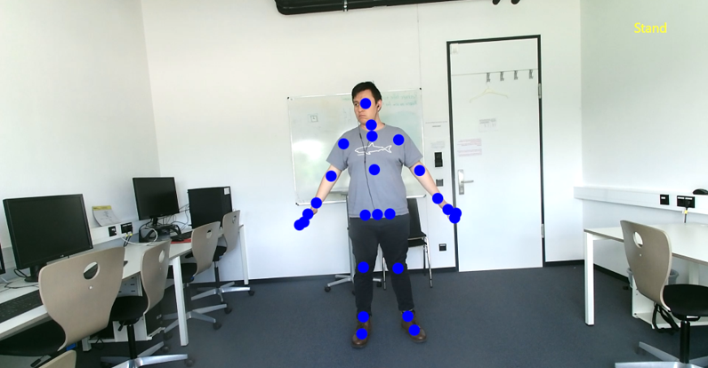
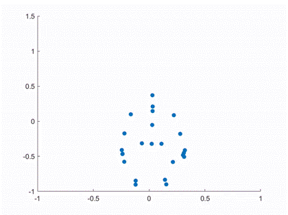

# Kinect-Based Human Motion Analysis

## Overview

This project implements a real-time human pose tracking and posture analysis system using Microsoft Kinect SDK and WPF.

The application captures RGB, depth, infrared, and skeletal tracking data from the Kinect sensor to detect sitting and standing postures through geometric joint analysis.

Motion data is recorded and later processed in MATLAB for visualization and offline analysis.

---

## Features

- Real-time skeletal tracking
- RGB / Depth / Infrared stream visualization
- Sit/Stand posture detection
- 3D joint coordinate extraction
- Interactive WPF graphical interface
- Audio feedback system
- Motion data recording
- MATLAB post-processing and visualization

---

## Technologies

- C#
- Microsoft Kinect SDK
- WPF (Windows Presentation Foundation)
- MATLAB
- Visual Studio 2022

---

## System Pipeline

```text
Kinect Sensor
      ↓
Body Tracking
      ↓
Joint Extraction
      ↓
Pose Estimation
      ↓
Data Recording
      ↓
MATLAB Analysis
```

---

## Pose Estimation Method

The posture estimation algorithm analyzes the geometric relationship between body joints obtained from Kinect skeletal tracking.

The system computes the angles formed between:

- Neck → Hip
- Hip → Knee

The average angular deviation is used to classify the posture as:

- Standing
- Sitting

---

## Project Structure

```text
Kinect-Pose-Tracking/
│
├── src/                # Main WPF application source code
├── matlab/             # MATLAB analysis scripts
├── assets/             # Images, sounds, and demo files
├── data/               # Sample recordings
├── results/            # Output visualizations
├── README.md
├── .gitignore
└── KinectPoseTracking.sln
```

---

## Main Functionalities

### Multi-Source Kinect Streams

The application processes:

- Color stream
- Depth stream
- Infrared stream
- Body tracking stream

### Real-Time Joint Tracking

Tracked joints are mapped into 2D space and rendered dynamically on the graphical interface.

### Data Recording

For each frame, the system records:

- Frame Number
- Joint type
- X coordinate
- Y coordinate
- Z coordinate

The generated dataset can be used for offline motion analysis.

### MATLAB Analysis

Recorded motion data is further analyzed in MATLAB for:

- Visualization
- Statistical analysis
- Motion evaluation

---

## Installation

### Requirements

- Windows 10/11
- Visual Studio 2022
- Kinect SDK v2
- Kinect Sensor v2
- MATLAB (optional for post-processing)

---

## Running the Project

1. Open the solution file:

```text
KinectPoseTracking.sln
```

2. Build the project in Visual Studio.

3. Connect the Kinect sensor.

4. Run the application.

---

## Example Results

### Skeleton Tracking



### MATLAB Analysis



---

## Data Output Format

The system exports motion data in the following format:

```text
Frame, JointType, X, Y, Z
```

Example:

```text
1, 0, 0.234615, -0.07731995, 2.66669
1, 1, 0.2349251, 0.2246814, 2.652288
```

---

## Future Improvements

- Real-time gait analysis
- Machine learning posture classification
- ROS integration
- Multiple user tracking
- Real-time data streaming
- Advanced biomechanical analysis

---

## Author

David Enrique Veloz Renteria

---

## License

This project is intended for educational and research purposes.
